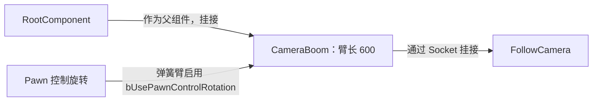

# AGAS_PlayerCharacter

`AGAS_PlayerCharacter` 继承 `AGAS_BaseCharacters`。它从 PlayerState 取得 ASC 和属性集，把当前角色设为 AvatarActor，广播数据引用通知，并在服务端授予能力及应用初始属性效果。

当前 PlayerState 实际创建的是 `UGAS_AbilitySystemComponent`。玩家通过接口访问该组件；与敌人自身持有组件的方式对照见 [敌人角色](EnemyCharacter.md)。

源码：`Source/GAS_Learning/Characters/GAS_PlayerCharacter.h`、`GAS_PlayerCharacter.cpp`。

## 头文件：成员与函数

| 可见性 | 声明 | 职责 |
| --- | --- | --- |
| public | `AGAS_PlayerCharacter()` | 胶囊体、控制旋转与摄像机配置 |
| public override | `GetAbilitySystemComponent() const` | 转发到 AGAS_PlayerState 的组件 |
| public override | `GetAttributeSet() const` | 转发到 AGAS_PlayerState 的属性集 |
| public override | `PossessedBy(AController*)` | 服务端初始化、广播、授予能力、应用初始属性 |
| public override | `OnRep_PlayerState()` | 客户端引用复制回调中初始化并广播 |
| private | `TObjectPtr<USpringArmComponent> CameraBoom` | EditAnywhere，Camera；弹簧臂 |
| private | `TObjectPtr<UCameraComponent> FollowCamera` | EditAnywhere，Camera；跟随摄像机 |


## AGAS_PlayerCharacter：胶囊体与摄像机

摘自 `Source/GAS_Learning/Characters/GAS_PlayerCharacter.cpp` 的构造函数，仅保留摄像机创建和挂接部分，省略空行：

```cpp
CameraBoom = CreateDefaultSubobject<USpringArmComponent>(FName("CameraBoom"));
CameraBoom->SetupAttachment(GetRootComponent());
CameraBoom->TargetArmLength = 600.f;
CameraBoom->bUsePawnControlRotation = true;
FollowCamera = CreateDefaultSubobject<UCameraComponent>(FName("FollowCamera"));
FollowCamera->SetupAttachment(CameraBoom,USpringArmComponent::SocketName);
FollowCamera->bUsePawnControlRotation = false;
```

前四行对应下方流程图中的弹簧臂节点，后三行对应跟随摄像机节点。

| 设置 | 当前值 | 作用 |
| --- | --- | --- |
| 胶囊体 | 半径 `42.f`，半高 `96.f` | 调用 `InitCapsuleSize` 设置碰撞胶囊尺寸 |
| Controller 旋转 | Pitch / Yaw / Roll 均为 `false` | 不直接使用这些开关驱动角色旋转 |
| `CameraBoom` | 挂到 RootComponent，臂长 `600.f` | 提供弹簧臂摄像机距离 |
| 弹簧臂控制旋转 | `bUsePawnControlRotation = true` | 使用 Pawn 的控制旋转 |
| `FollowCamera` | 挂到弹簧臂 Socket | 跟随弹簧臂 |
| 摄像机控制旋转 | `bUsePawnControlRotation = false` | 不在摄像机上重复使用 Pawn 控制旋转 |

构造函数也关闭了 Actor Tick。当前 C++ 没有设置 `bOrientRotationToMovement` 或角色转向速度，不能仅据摄像机代码推断角色必然朝移动方向旋转；如需确认，应检查角色蓝图与 CharacterMovement 默认值。


```mermaid
flowchart LR
    root["RootComponent"] -->|"作为父组件，挂接"| boom["CameraBoom：臂长 600"]
    boom -->|"通过 Socket 挂接"| camera["FollowCamera"]
    control["Pawn 控制旋转"] -->|"弹簧臂启用 bUsePawnControlRotation"| boom
```

前两条边表示组件挂接关系，最后一条表示旋转数据来源；摄像机本身的 `bUsePawnControlRotation` 为 `false`。

## GetAbilitySystemComponent：从 PlayerState 取得 ASC

```cpp
UAbilitySystemComponent* AGAS_PlayerCharacter::GetAbilitySystemComponent() const
{
    const AGAS_PlayerState* CurPlayerState =
        Cast<AGAS_PlayerState>(GetPlayerState());
    if (!CurPlayerState) return nullptr;

    return CurPlayerState->GetAbilitySystemComponent();
}
```

角色接口与 PlayerState 接口最终返回同一个 ASC。PlayerState 尚未就绪或类型不符时返回空，调用者必须处理这种情况。

## GetAttributeSet：转发到 PlayerState

摘自 `GAS_PlayerCharacter.cpp`，保留完整函数，省略空行：

```cpp
UAttributeSet* AGAS_PlayerCharacter::GetAttributeSet() const
{
    const AGAS_PlayerState* CurPlayerState = Cast<AGAS_PlayerState>(GetPlayerState());
    if (!CurPlayerState) return nullptr;
    return CurPlayerState->GetAttributeSet();
}
```

与 ASC getter 一样，PlayerState 类型不兼容或尚未就绪时返回空。返回的是 PlayerState 持有的属性集，本类不再创建一份。

## PossessedBy：服务端初始化与授予

以下摘自 `GAS_PlayerCharacter.cpp` 的 `PossessedBy()`，保留函数体开头至初始属性调用，省略空行及注释。

```cpp
Super::PossessedBy(NewController);
UAbilitySystemComponent* CurAbilitySystemCom = GetAbilitySystemComponent();
if (!CurAbilitySystemCom || !HasAuthority()) return;
CurAbilitySystemCom->InitAbilityActorInfo(GetPlayerState(), this);
OnASCInitialized.Broadcast(CurAbilitySystemCom,GetAttributeSet());
GiveStartupAbilities();
InitializeAttributes();
```

调用顺序与客户端初始化的区别见下方流程图。

`InitAbilityActorInfo(OwnerActor, AvatarActor)` 的第一个参数是 PlayerState，第二个参数是当前角色；不是把 Controller 当作能力的 OwnerActor。授予入口由基类处理，按标签尝试自动激活的逻辑由自定义 ASC 的授予回调承担。

## OnRep_PlayerState：客户端初始化

以下摘自 `GAS_PlayerCharacter.cpp` 的 `OnRep_PlayerState()`，保留广播至 Health 委托绑定的部分，省略空行。

```cpp
CurAbilitySystemCom->InitAbilityActorInfo(GetPlayerState(),this);
OnASCInitialized.Broadcast(CurAbilitySystemCom,GetAttributeSet());
UGAS_AttributeSet* GAS_AttributeSet = Cast<UGAS_AttributeSet>(GetAttributeSet());
if (!GAS_AttributeSet) return;
CurAbilitySystemCom->GetGameplayAttributeValueChangeDelegate(GAS_AttributeSet->GetHealthAttribute()).AddUObject(this,&ThisClass::OnHealthChanged);
```

`OnRep_PlayerState()` 是 PlayerState 引用复制后的回调，不是手动复制整个 PlayerState 的函数。这里在客户端补齐 ActorInfo 并广播，不再次调用 `GiveStartupAbilities()` 或 `InitializeAttributes()`。

两个入口分别处理服务端占有和客户端 PlayerState 就绪。只读服务端的 `PossessedBy()`，会漏掉客户端初始化这一步。


```mermaid
flowchart TD
    subgraph serverSide["服务端入口"]
        possessed["PossessedBy"] -->|"先执行"| serverSuper["Super.PossessedBy"]
        serverSuper -->|"取得 ASC 后检查"| serverValid{"ASC 有效且 HasAuthority？"}
        serverValid -->|"否"| serverReturn["提前返回"]
        serverValid -->|"是"| serverInfo["InitAbilityActorInfo：PlayerState / 当前角色"]
        serverInfo -->|"先广播 ASC 与属性集指针"| serverSignal["OnASCInitialized.Broadcast"]
        serverSignal -->|"广播之后调用"| grant["GiveStartupAbilities"]
        grant -->|"授予之后调用"| values["InitializeAttributes：应用初始 GE"]
        values -->|"属性集转型成功后"| healthServer["订阅 Health 变化"]
    end
    subgraph clientSide["客户端入口"]
        replicated["PlayerState 引用复制"] -->|"触发回调"| onRep["OnRep_PlayerState"]
        onRep -->|"先执行"| clientSuper["Super.OnRep_PlayerState"]
        clientSuper -->|"取得 ASC 后检查"| clientValid{"ASC 是否有效？"}
        clientValid -->|"否"| clientReturn["提前返回"]
        clientValid -->|"是"| clientInfo["InitAbilityActorInfo：PlayerState / 当前角色"]
        clientInfo -->|"广播 ASC 与属性集指针"| clientSignal["OnASCInitialized.Broadcast"]
        clientSignal -->|"属性集转型成功后"| healthClient["订阅 Health 变化"]
    end
```

两端流程独立展示，不代表 `PossessedBy()` 直接调用客户端回调。广播参数的属性集 getter 可能返回空；广播早于本次服务端初始 GE 应用，因此 UI 不能仅凭这条通知判断属性值已就绪。

## 当前实现的边界

当前没有保存授予返回的 Spec Handle，也没有实现重占有时防止重复授予、换 Pawn 时取消旧能力或重生重置的逻辑。这些行为不属于本类当前实现。

参见：[角色基类](CharacterBase.md)、[PlayerState](../Player/PlayerState.md)、[启动能力与激活流程](../AbilitySystem/StartupAbilities.md)。

## Health 委托的绑定位置

服务端在初始属性应用之后绑定，客户端在 `OnRep_PlayerState()` 广播之后绑定。 两条角色实现均要求属性集能转型为 `UGAS_AttributeSet`。成功后用 `AddUObject` 将 ASC 的 Health 变化委托交给基类 `OnHealthChanged()`。该绑定接收之后发生的变化，建立时没有主动读取当前 Health 执行死亡判断。参见 [角色基类](CharacterBase.md)。
